# LogicSprint: Brain Games

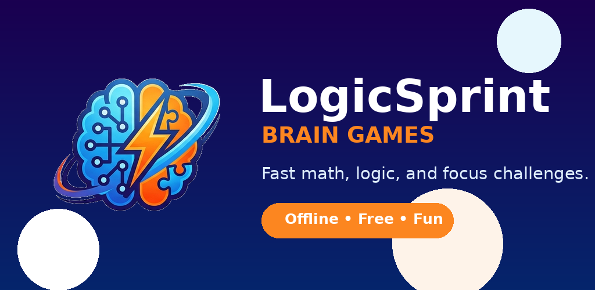

**LogicSprint** is a free Flutter brain-training app for Android: four quick games, personal bests on the device, and an optional global Top 10 per game. No login. Ad-supported via Google AdMob.

| | |
|---|---|
| **Version** | 1.0.0 |
| **Platform** | Android (Google Play); iOS later |
| **Stack** | Flutter 3.x, Dart 3.11+ |
| **Storage** | `shared_preferences` on the device; Supabase for the leaderboard |

---

## Screenshots

<table>
  <tr>
    <td align="center">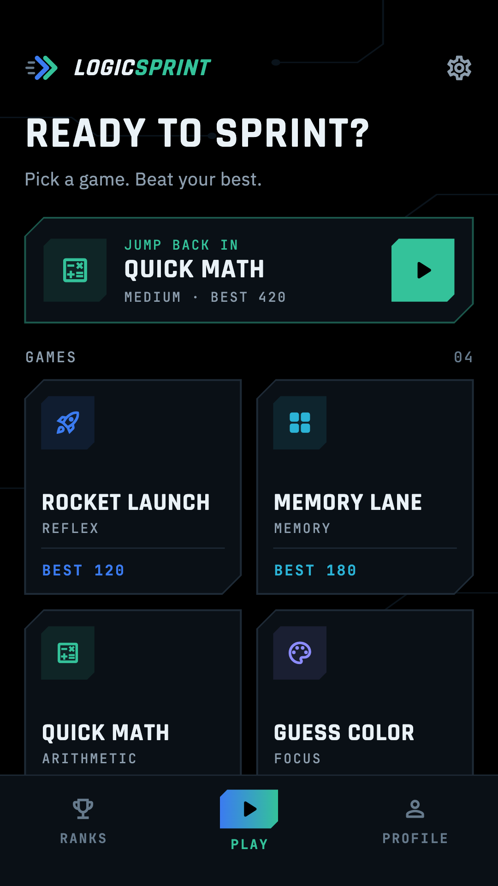<br><sub>Home (Play tab)</sub></td>
    <td align="center">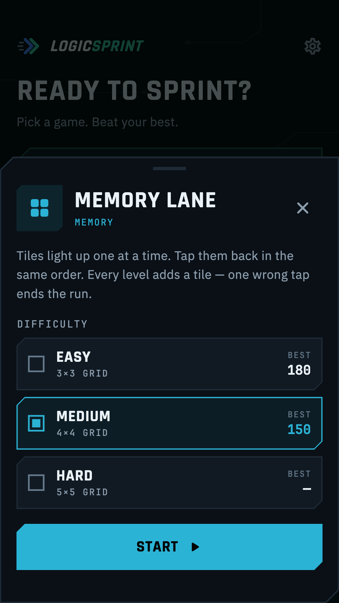<br><sub>Game sheet</sub></td>
    <td align="center">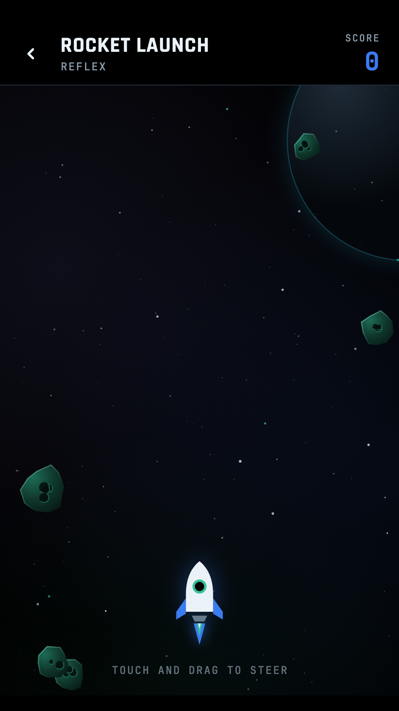<br><sub>Rocket Launch</sub></td>
  </tr>
  <tr>
    <td align="center">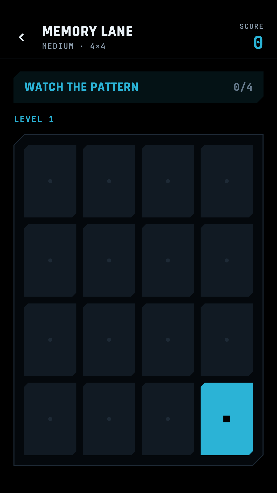<br><sub>Memory Lane</sub></td>
    <td align="center">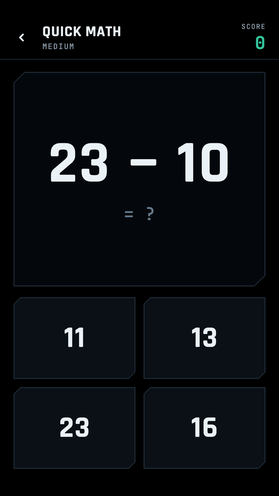<br><sub>Quick Math</sub></td>
    <td align="center">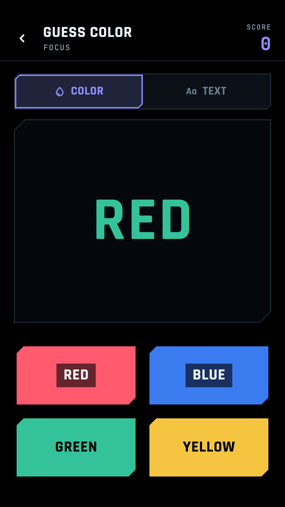<br><sub>Guess Color</sub></td>
  </tr>
  <tr>
    <td align="center">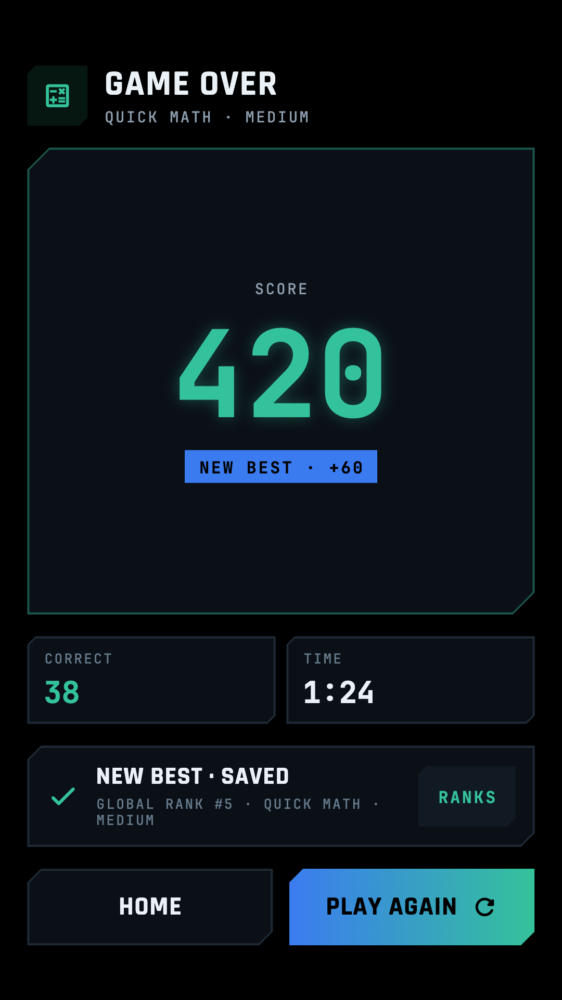<br><sub>Result</sub></td>
    <td align="center">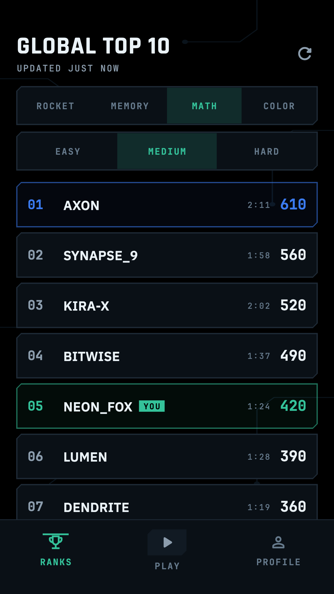<br><sub>Ranks</sub></td>
    <td align="center">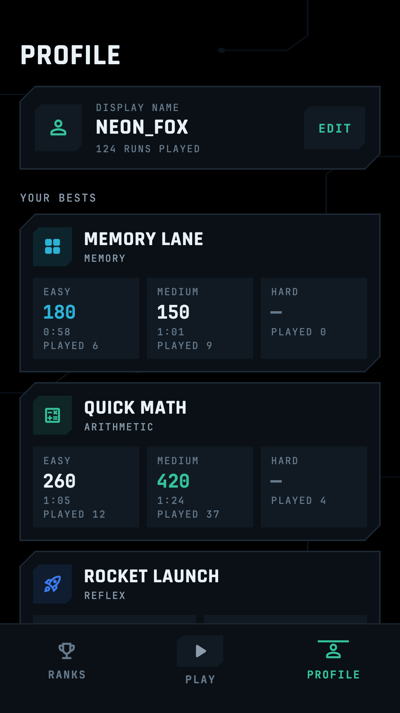<br><sub>Profile</sub></td>
  </tr>
</table>

These are the Google Play screenshots (9:16), rendered from the real screens. See [Store screenshots](#store-screenshots) to regenerate them.

---

## Games

Every game is an **endless run**: it keeps getting harder until your first mistake. Once per run you can watch a rewarded ad for **one more life**. +10 per correct action, plus a hidden +20 bonus every 5-in-a-row. Memory Lane and Quick Math also record how long each run took, and on their leaderboards a faster run wins a tie; Rocket Launch and Guess Color are about how far you get, so a tie goes to whoever reached the score first.

| Game | Skill | How it plays | Difficulty |
|------|-------|--------------|------------|
| **Rocket Launch** | Reflex | Touch and drag anywhere to steer through a green asteroid storm; one hit ends the run | Speeds up the longer you survive |
| **Memory Lane** | Memory | Tiles flash in sequence; tap them back in order, one more tile each level; one wrong tap ends the run | Easy 3×3 · Medium 4×4 · Hard 5×5 |
| **Quick Math** | Arithmetic | Tap the right answer of four; numbers and operations grow every 10 problems; one wrong answer ends the run | Easy + − · Medium + − × · Hard + − × ÷ |
| **Guess Color** | Focus | A COLOR \| TEXT switch sets the rule: COLOR = tap the color the word is painted in, TEXT = tap the color the word names. The rule flips, buttons shuffle, their labels stop matching their colors, and the countdown shrinks from 3 s to 1 s | Gets trickier as you go |

---

## App structure

Bottom nav: **Ranks · Play · Profile** (Play in the middle, the default). Settings opens from the gear on Play.

```text
lib/
  main.dart, app.dart        # bootstrap, providers, NavTabs
  core/                      # theme (Circuit Noir palette + fonts), config
  models/                    # GameId, Difficulty, RoundResult, LeaderboardEntry
  services/                  # storage, leaderboard (Supabase), ads (AdMob + UMP)
  state/app_state.dart       # settings, bests, haptic/sound feedback
  ui/                        # chamfered UI kit, logo, game bar, ad banner
  games/                     # RoundEngine + RoundScreen, one folder per game
  screens/                   # splash, shell tabs, game sheet, result, settings, privacy
test/                        # engine, leaderboard, model and app smoke tests
assets/fonts/                # Rajdhani, IBM Plex Sans, JetBrains Mono (OFL, licenses included)
assets/brand/                # icons, Play Store art + screenshots, privacy policy, listing copy
design/wireframes/           # design canvas: screens, Guess Color stages, identity options (.dc.html)
supabase/schema.sql          # profiles, per-game bests, RLS, functions, views
config/admob.example.json    # AdMob config template (real config is gitignored)
```

Each game is an engine (`RoundEngine` subclass: pure logic, unit-tested with `fake_async`) plus a screen hosted by `RoundScreen`, which runs the endless run, offers the one rewarded-ad revive when it goes down, saves the best (score and time) and opens Result.

---

## Getting started

```bash
make setup
make emulator    # optional
make run
```

Debug builds use Google's AdMob test IDs automatically.

```bash
make check       # flutter analyze + flutter test (same as CI)
```

After changing icon PNGs: `make icons`.

---

## Release builds

Release builds need two gitignored files:

- `android/key.properties` + upload keystore — [docs/android_release_signing.md](docs/android_release_signing.md)
- `config/admob.json` — copy [config/admob.example.json](config/admob.example.json) and fill in your AdMob IDs

```bash
make build-aab
```

Gradle refuses release builds without `ADMOB_APP_ID`, and bundles without a release keystore. Full steps: [docs/release_checklist.md](docs/release_checklist.md)

---

## Leaderboard

- An invisible anonymous Supabase account per install; the display name is chosen once (Result, Ranks or Profile) and is unique
- Every finished run is sent automatically (queued while offline): the server keeps each player's best and play count per game and difficulty
- One Top 10 per game (and per difficulty for Memory Lane and Quick Math) plus your own rank pinned below it; ties go to the faster run in Memory Lane and Quick Math, and to the earlier best elsewhere
- Each board cached for a day and refetched after a new personal best; manual refresh has a 60 s cooldown; requests time out after 8 s
- Run History stays on the device (Profile); fully playable offline

Setup: enable **Anonymous sign-ins** (Authentication → Providers), then run [supabase/schema.sql](supabase/schema.sql) in the SQL editor. The publishable key in `lib/core/config.dart` is safe to ship: tables are read-only under RLS, and writes go through `claim_name` / `record_run`, which only touch the caller's own rows. The `player_stats` and `game_stats` views feed the product page.

---

## Ads

AdMob banner on the Play tab, and a rewarded ad ("Game Life") offered once per run for one more life — no interstitials. Consent is gathered with Google's UMP SDK before any ad request; users in consent regions get **Privacy choices** in Settings. IDs live in `config/admob.json` (`ADMOB_APP_ID`, `ADMOB_BANNER_ID`, `ADMOB_REWARDED_ID`).

---

## Git workflow

`production` is the main branch: commit and push there directly (CI runs analyze + test on every push). Push a `vX.Y.Z` tag to build the signed store release. See [docs/git_workflow.md](docs/git_workflow.md).

## Brand & design

The look is called **Circuit Noir**: a pure-black AMOLED background, faint circuit traces, chamfered (cut-corner) panels, and one accent color per game. The palette and fonts live in [lib/core/theme.dart](lib/core/theme.dart).

| Role | Color | Used for |
|------|-------|----------|
| Teal | `#34C29A` | Primary accent, "Sprint" in the wordmark, Quick Math |
| Blue | `#3B7BF0` | Rocket Launch, the logo chevron |
| Aqua | `#2BB3D6` | Memory Lane |
| Violet | `#8C8CFF` | Guess Color |
| Coral | `#FF5A6E` | Errors, wrong answers, the revive heart, the red Guess Color button |
| Gold | `#F5C542` | The yellow Guess Color button |

Fonts: **Rajdhani** for headings, **IBM Plex Sans** for body text and **JetBrains Mono** for labels and numbers.

<p>
  
  &nbsp;
  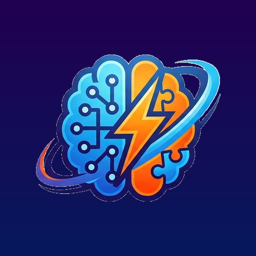
</p>

| Asset | Path |
|-------|------|
| App icon (1024) + Android adaptive foreground | `assets/brand/icons/` |
| Play Store icon (512×512) | `assets/brand/store/google_play/play_store_icon_512.png` |
| Feature graphic (1024×500) | `assets/brand/store/google_play/feature_graphic_1024x500.png` |
| Google Play screenshots (9:16, 1080×1920) | `assets/brand/store/google_play/screenshots/` |
| Tall screenshots (1080×2400) | `assets/brand/store/screenshots/` |
| Listing copy, ready to paste into Play Console | [assets/brand/docs/store_listing.md](assets/brand/docs/store_listing.md) |
| Privacy policy | [assets/brand/docs/privacy_policy.md](assets/brand/docs/privacy_policy.md) |

The design canvas is in `design/wireframes/`: `canvas.json` lays out the `.dc.html` artboards across three pages.

- **Screens**: the app flow, the Circuit Noir theme sheet, and every screen from 01 Splash to 12 Privacy policy, including the revive offer and the name sheet
- **Guess Color stages**: GC1–GC6 (Classic → Scrambled → Countdown → Rule swap → Mismatched labels → Neutral + distractions), plus the COLOR and TEXT rule states
- **Identity options**: the naming explorations A–D (LogicSprint, NeuroDash, Synapse, MindGrid). Option A won.

## Store screenshots

Rendered from the real screens with the bundled fonts, so no emulator is needed:

```bash
SCREENSHOTS=play ICONS_FONT="$(dirname "$(readlink -f "$(which flutter)")")/cache/artifacts/material_fonts/MaterialIcons-Regular.otf" \
  flutter test test/store_screenshots_test.dart
```

| `SCREENSHOTS=` | Size | Output |
|----------------|------|--------|
| `play` | 1080×1920 (9:16, Google Play) | `assets/brand/store/google_play/screenshots/` |
| `1` | 1080×2400 | `assets/brand/store/screenshots/` |

Extra takes named `*_take*.png` are gitignored.

## License

Private project (`publish_to: none`). Bundled fonts are under the SIL Open Font License; see `assets/fonts/*-OFL.txt`.
